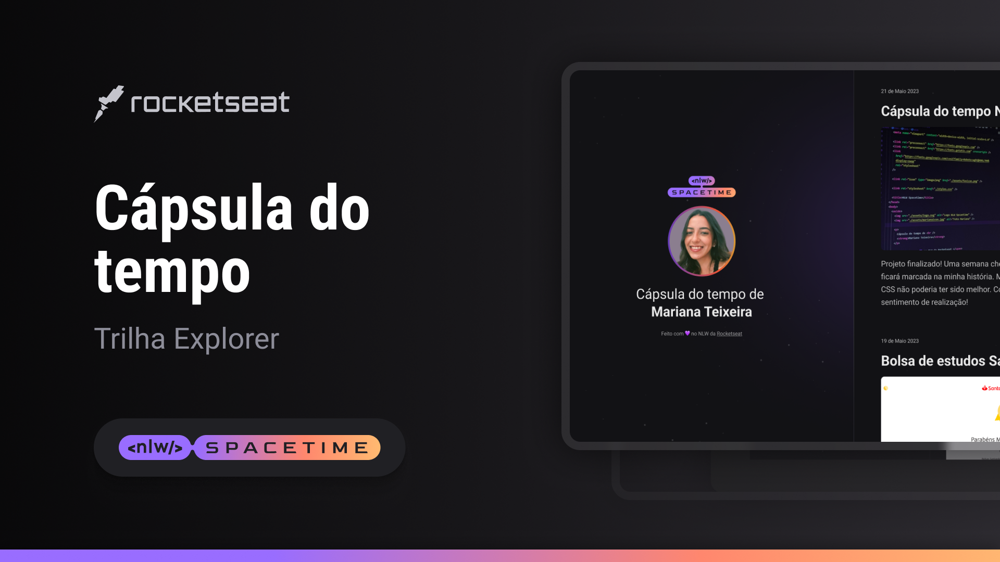

  

## Projeto

Esse é um projeto Web Responsivo de uma cápsula do tempo para exibir memórias em uma linha do tempo.

## Tecnologias

Esse projeto foi desenvolvido durante o NLW da Rocketseat com as seguintes tecnologias:

- HTML
- CSS
- Git e Github
